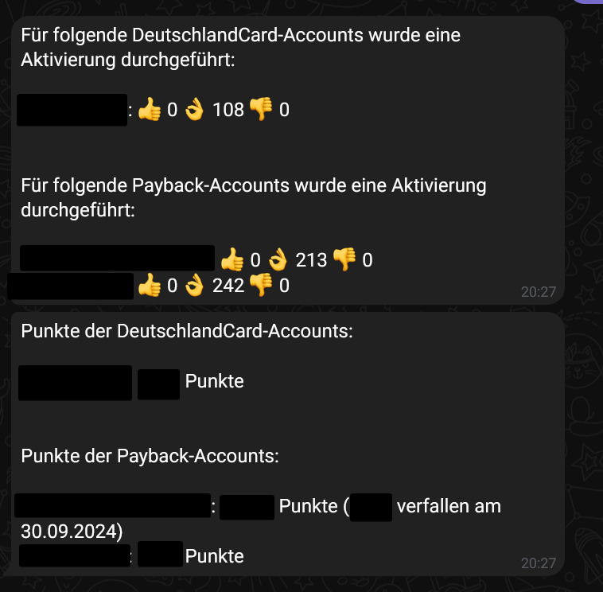

# python-coupons-activate

Diese Anwendung aktualisiert in regelmäßigen Zeitintervallen alle verfügbaren Coupons der deutschen Bonussystem-Betreiber [Payback](https://de.wikipedia.org/wiki/Payback_(Bonusprogramm)) und [DeutschlandCard](https://de.wikipedia.org/wiki/DeutschlandCard). 
Die entsprechenden APIs der Anbieter wurden mittels Reverse Engineering der entsprechenden mobilen Apps ermittelt. Die Anwendung wird über einen Telegram-Bot gesteuert und dieser informiert auch über entsprechende Aktivierungen. 



Hier wird nur ein Ausschnitt der API der hinreichend dafür ist, alle Coupons des verknüpften Konto zu aktivieren, implementiert. 


## Konfiguration

Es sind die entsprechenden Variablen in der secrets.properties zu setzen. Diese muss sich im Root-Ordner der Anwendung befinden. Als Vorlage steht die Datei secrets.properties.rename zur Verfügung.

```
# This is a properties file to store secret values
# Rename this file to secrets.properties and replace the example value with your own token

[secrets]
# api token for the telegram bot
TELEGRAM_API_TOKEN = 123456789:ABCDEFGHIJKLMNOPQRSTUVWXYZ
# only these users are allowed to receive messages with confidential information and interact with the bot
ALLOWED_USER_IDS = 123456789,987654321

# Die APIs benötigen beide ein spezielles API-Token, welches nur
# der Client kennt. Diese können mittels Reverse-Engineering der
# Android-Apps oder der iOS-Apps herausgefunden und extrahiert werden.
DEUTSCHLANDCARD_SECRET_API_TOKEN=123456789ABCDEFGHIJK+==

PAYBACK_BASIC_AUTH_USERNAME=iosapp_de_23a
PAYBACK_BASIC_AUTH_CREDENTIAL=LKAJSDkaskdjskds
PAYBACK_PRINCIPAL=138

# Nur für das lokale Testen erforderlich:
# Im produktiven Modus werden die Login-Daten
# in einer Datenbank gespeichert und dynamisch registriert.
DEBUG_DEUTSCHLANDCARD_CARD_NUMBER = 1234567891
DEBUG_DEUTSCHLANDCARD_GEBURTSDATUM = 2005-07-12
DEBUG_DEUTSCHLANDCARD_PLZ = 12345

DEBUG_PAYBACK_CARD_NUMBER = 123456790123
DEBUG_PAYBACK_PASSWORD = ABCDEFGH
```

Folgende Ergänzungen gelten:

- Die DEBUG*-Eigenschaften müssen nicht gesetzt werden. Sie erlauben es jedoch die Aktivierung aller Coupons mit den Dateien *DeutschlandCard_Tester.py* und *Payback_Tester.py* zu verproben. 

Die Eigenschaften *DEUTSCHLANDCARD_SECRET_API_TOKEN*, *PAYBACK_BASIC_AUTH_USERNAME*, *PAYBACK_BASIC_AUTH_CREDENTIAL*, *PAYBACK_PRINCIPAL* müssen mittels Reverse-Engineering der entsprechenden Apps der Anbieter ermitelt werden. DEUTSCHLANDCARD_SECRET_API_TOKEN wird innerhalb der HTTP-Header der Aufrufe an die DeutschlandCard-Server versendet. Die Eigenschaften *PAYBACK_BASIC_AUTH_USERNAME* und *PAYBACK_BASIC_AUTH_CREDENTIAL* werden von der Payback-App mittels Basic-Auth im HTTP-Header versendet. Das *PAYBACK_PRINCIPAL* ist innerhalb der URL zu sehen, aber auch in der typischen Kommunikation der Payback-App. Das Reverse Engineering erfolgte mit dem Tool [Frida](https://frida.re/docs/ios/).

## Installation
Für die Installation ist Python 3.11 und das Tool pipenv notwendig. Die Installation erfolgt wie folgt:

```
pipenv install
```

## Ausführung
Die Anwendung wird wie folgt ausgeführt:

```
pipenv run python ./src/main.py
```

## Verwendung
Sobald der selbst erstellte Telegram-Bot gestartet wurde und in der eigenen Freundesliste hinzugefügt wurde, kann dieser über die Telegram-App verwendet werden. 

Der Telegram-Bot implementiert die folgenden Kommandos:

 - *register_dc*: Registriert einen DeutschlandCard-Account anhand der Kundennummer, dem Geburtsdatum und der Postleitzahl in der internen Datenbank. Beim nächsten Zeitintervall werden die Coupons dieses Accounts aktiviert.
 - *register_payback*: Registriert einen Payback-Account anhand der E-Mail-Adresse oder der Kundennumemr und dem Passwort in der internen Datenbank. Beim nächsten Zeitintervall werden die Coupons dieses Accounts aktiviert.
 - *activate_coupons*: Führt den Prozess der Aktivierung unabhängig des Zeitintervalls für alle registrierten Accounts aus.
 - *remove_account*: Löscht einen Account aus der internen Datenbank.
 - *cancel*: Bricht die aktuelle Konversation der obenstehenden Befehle ab.

Der Prozess der Aktivierung gibt für jeden registrierten Account die Anzahl der aktivierten, übersprungenen und fehlerhaften Coupons aus. Übersprungene Coupons sind solche, die nicht maschinell aktiviert werden können, die bereits aktiviert sind oder aus sonstigen Gründen nicht aktiviert werden können. Fehlerhafte Coupons sind solche die aus irgendeinem Grund, der zu einer nicht behandelten Exception geführt hat, nicht behandelt werden konnte. Zusätzlich gibt der Bot den aktuellen Punktestand inklusive bald ablaufender Punkte und deren Verfallsdatum der Konten aus.

## DeutschlandCard-API

Die folgenden Methoden der DeutschlandCard-API sind implementiert:

 - */members/login*: Authentifizierung (hier nur mit der Anmeldemethode Kundennummer, Geburstdatum und PLZ)
 - */members/points*: Fragt den aktuellen Punktestand ab.
 - */members/coupons/query*: Fragt alle bestehenden Coupons ab.
 - */members/coupons/registration*: Aktiviert einen Coupon.

Weitere Informationen können sind in der Datei DeutschlandCardApi.py enthalten.

## Payback-API

Die folgenden Methoden der Payback-API sind implementiert:

 - */json/secureauthenticate*: Authentifizierung (hier nur mit Kundennummer oder E-Mail)
 - */json/getaccountbalance*: Fragt den aktuellen Punktestand ab.
 - */json/getcoupons*: Fragt alle bestehenden Coupons ab.
 - */json/activatecoupon*: Aktiviert einen Coupon.

## Deployment
Es wird das Deployment auf einen von außen nicht zugreifbaren Webserver, zum Beispiel einem Raspberry Pi in einem eigenen Haushalt hinter einer Firewall empfohlen, da die hinterlegten Konfigurationen sensitiv sind. 

Das Deployment erfolgt mittels der Datei deploy/deploy.py. Diese verwendet die Variablen DEPLOY_REMOTE_HOST, DEPLOY_REMOTE_USER und DEPLOY_REMOTE_PASSWORD aus der deploy.properties. Diese müssen entsprechend gesetzt werden. Dann erfolgt das Deployment auf ein Raspbian-System. Python und pipenv werden installiert, falls benötigt und ein SystemD-Service wird erstellt.


